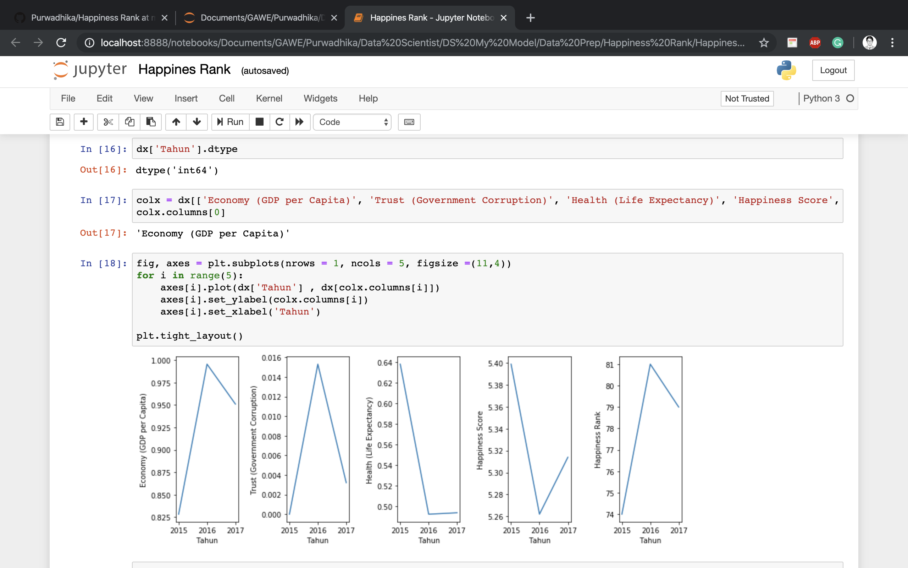

# Happines Rank from 2015-2017, world scale

This dataset consist of 3 CSV, each of them contain information about happiness rank for every country in the world, the goal is to filter which country is the " happiest " & make some visualization about it

### Data Source ?

From my mentor

### Do you need modelling for this case ?

Not needed, just filtering and some visualization

### a little bit of my work

Well, here you go, the filtered dataframe, contains top three of the happiest country for each year

And some visualization

### Please tell us how to filter the dataset !

Please read my notebook..
