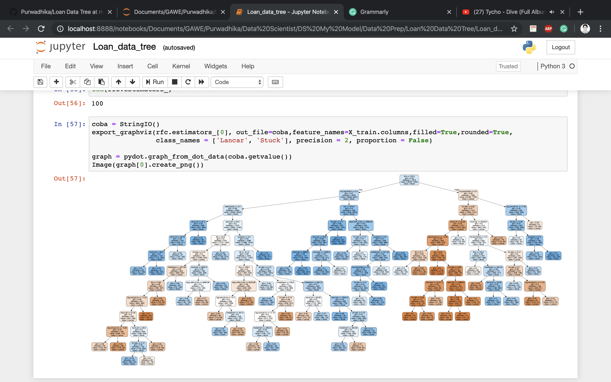

# Loan Data Tree

This dataset consists data about users info and loan status, the goal is to predict which user that has loan fraud or not

### Data Source

From my mentor

### How to handle it ?

Please read the notebook

### How to handle the imbalance from all of the target ?

Please read the notebook, i am using all of the possibility ( SMOTE, ROS, Undersampling etc.. )

### How to show the classification report ?

```python
  def awawaa (X,Y,model):
    
    X_train,X_test,y_train,y_test = train_test_split(X,Y)
    ros = RandomOverSampler(random_state = 101)
    X_ros, y_ros = ros.fit_sample(X_train,y_train)
   
    clf = model()
    clf.fit(X_ros,y_ros)
    
    prediction_test = clf.predict(X_test)
    prediction_train = clf.predict(X_ros)
    print('Class Report Test Data')
    print(classification_report(y_test, prediction_test))
    print('===========================================================')
    print('Class Report Train Data')
    print(classification_report(y_ros, prediction_train))
    print('===========================================================')
```

### A little bit of my work

Sure, here you go, the complete random forest classification tree, to recognize which user that has fraud loan or not




