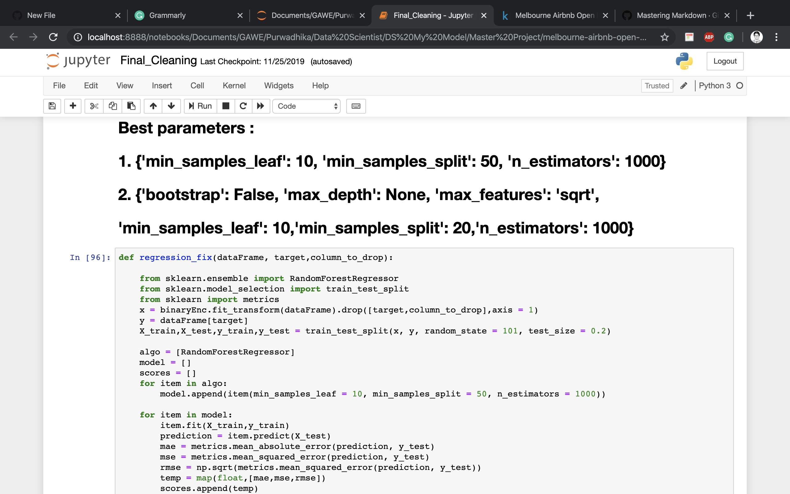
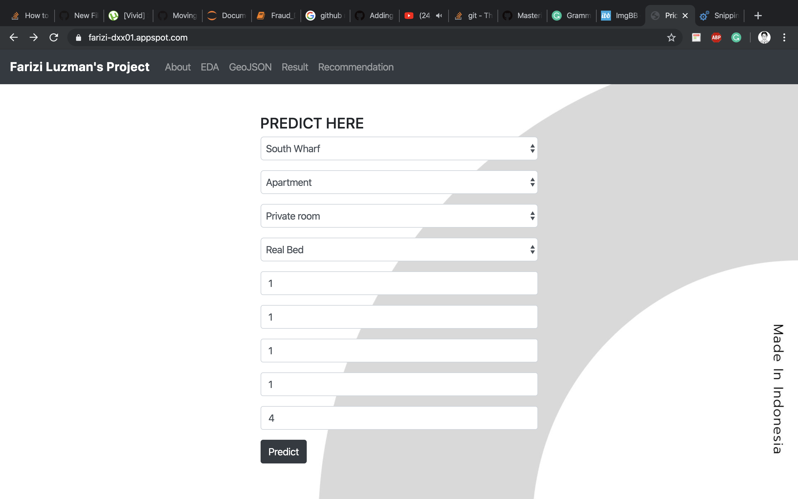
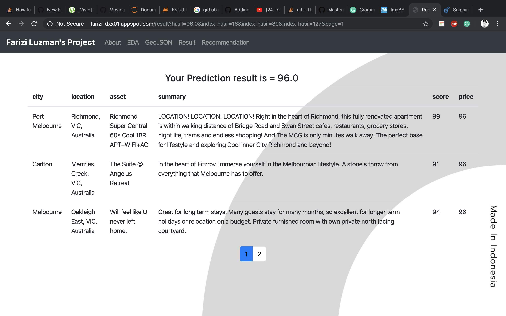
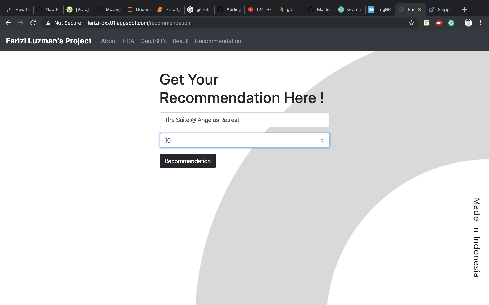
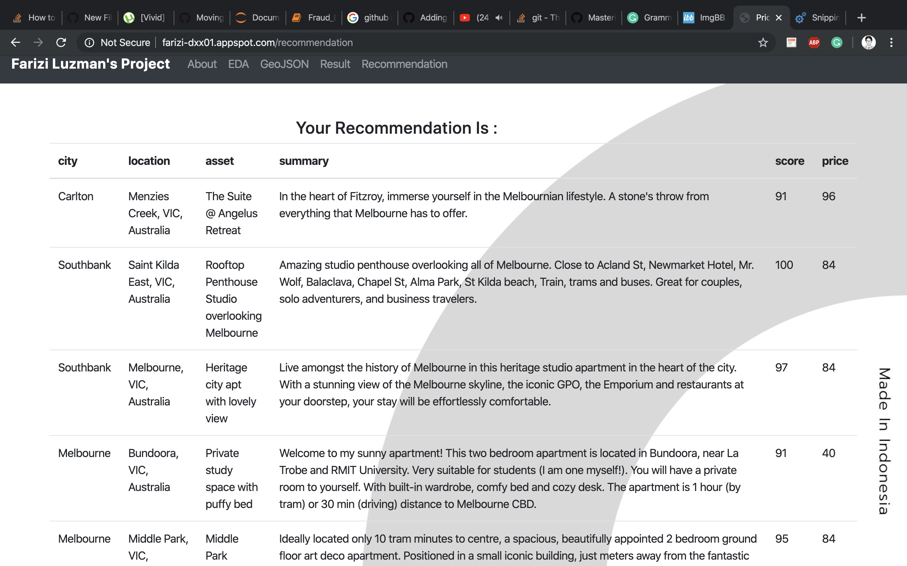
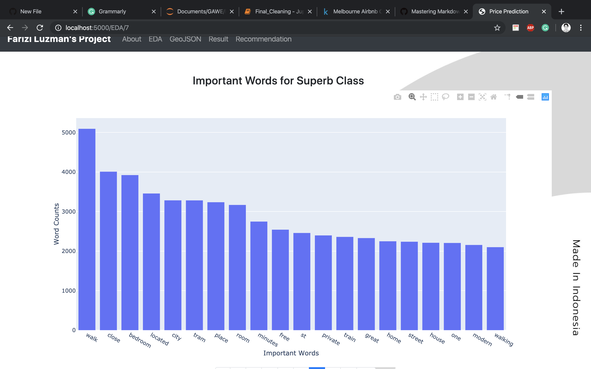

# Melbourne Airbnb Open Data

My grand project, it consists of information about Airbnb assets over Melbourne, from the price until the score of the assets, the goal of this project is :
1. Make prediction model for the price
2. Make Recommendation model for the assets
3. Make Word processing model recognize the most used word for each class of assets
4. Deploy it on Flask

### Data Source ?

https://www.kaggle.com/tylerx/melbourne-airbnb-open-data

### The data is too much to handle ! can you make a sample of it ?

Of course, you can, but because I'm already determined, I take all of it without any sample size

### How to handle the missing value ?

1. If the missing value is below 10 % ( my standard ), I'm using fillna method

```python
def mean_all(x):
    vara = x.fillna(x.mean())
    return vara
```
2. If the missing value is above 10 % ( my standard ), I'm using correlation method 

```python
# Membuat df2_test_province yang merupakan data yang provinsi, Lat, dan Long nya tidak null
df2_test_province = df2[(df2['state'].notnull()) & (df2['latitude'].notnull()) & (df2['longitude'].notnull())]
# Membuat df2_predict_province yang merupakan data yang provinsi null, tetapi Lat dan Long nya tidak null
df2_predict_province = df2[(df2['state'].isnull()) & (df2['latitude'].notnull()) & (df2['longitude'].notnull())]

```

```python
def fill_state(df):
    lat_diff = np.abs(df2['latitude'] - df2_test_province['latitude'])
    long_diff = np.abs(df2['longitude'] - df2_test_province['longitude'])
    diff = lat_diff + long_diff
    index_min = np.argmin(diff)
    return df2_test_province['state'].loc[index_min]

```

### How about EDA ? Feature engineering and modeling for each goal ?
Please read my notebook, I explain it very clear in there

### A little bit of my work

My Jupyter Notebook, looking for best parameter in Random Forest Regressor


My Flask interface


My Price prediction result


My Price prediction margin


My Recommendation model interface


My Recommendation model result


My Data visualization


My Assets heatmap


My Words Processing for every class of asset


### Cool ! I want to try it myself !

Be my guest, I already deployed it to the internet, all you have to do is just scan this QR code


