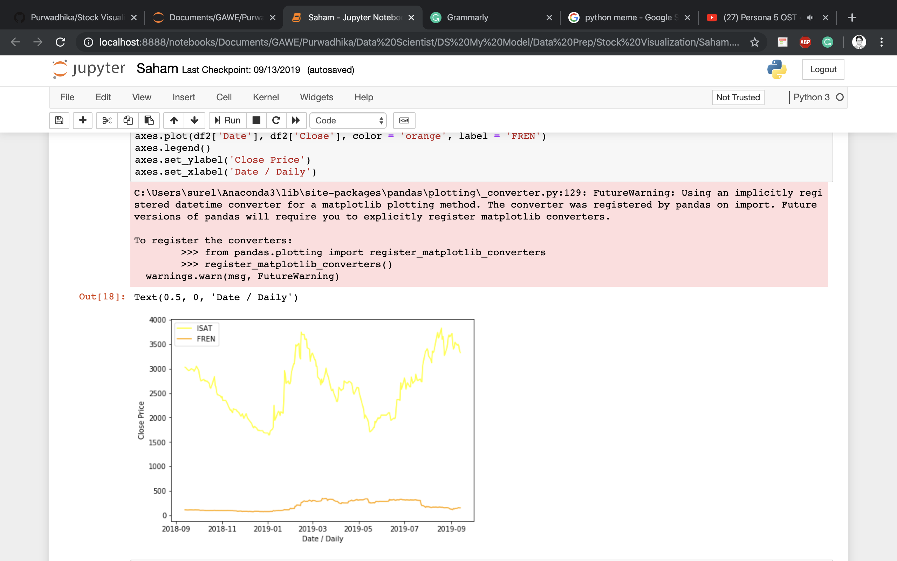

# Stock Visualization

This dataset contains information about Indonesia's stock price from September 2018 until September 2019, the goal is to make a simple visualization of a trend from the stock price

### Do you need modeling for this case ?

Nah, just a simple visualization

### How to make the visualizatiom ?

Please read my notebook

### A little bit of my work

