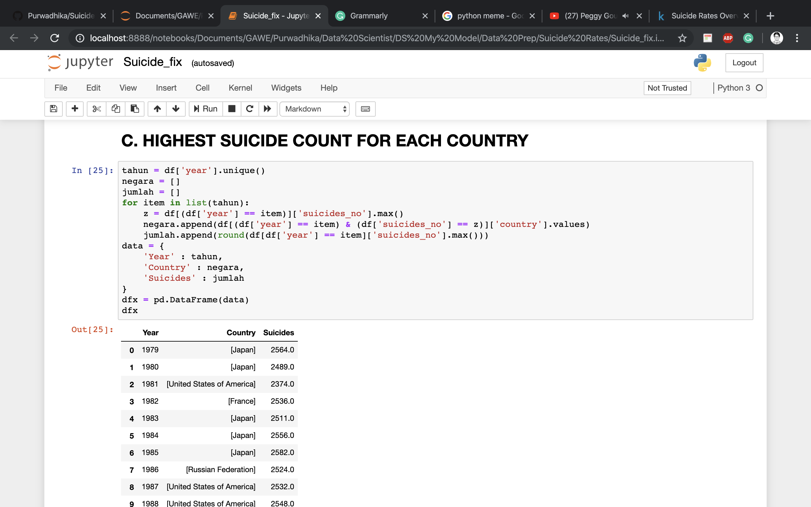

# Suicide Rates

This dataset contains information about suicide rate on a global scale from 1985-2016, the goal is to make visualization to show which country that has the highest suicide count every year

### Do you need modeling for this case ?

Nah, just a simple visualizatio and a filtering on dataframe

### How do yandle the filtering ?

Please read my notebook

### A little bit of my work

